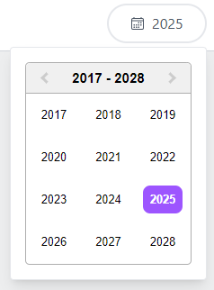

# @trackpilots/year-picker


A **customizable year picker** component built with **React** and **Tailwind CSS**.

## ✨ Screenshots  


---

## 🚀 Installation  
You can install the package using **npm** or **yarn**:  

### **Using npm**  
```sh
npm install @trackpilots/year-picker
# or
yarn add @trackpilots/year-picker
```

Make sure Tailwind CSS is installed in your project.

##  📌 Usage
Use in Your Component
```sh
import React, { useState } from "react";
import YearPicker from "@trackpilots/year-picker";

const App = () => {
  const [selectedYear, setSelectedYear] = useState(null);

  const handleChange = (year) => {
    setSelectedYear(year);
    console.log("Selected Year:", year);
  };


  return (
    <div className="p-4">
      <h2 className="text-lg font-bold">Date Picker</h2>
      <YearPicker
        onChange={handleChange}
      />
      <p>Selected Year: {selectedYear ? selectedYear.year : "None"}</p>
    </div>
  );
};

export default App;
```

## 📌 DateFilter Component
A React Select component that allows users to choose a Year

## ⚙️ Props  

| Prop Name      | Type              | Default          | Description                          |
|---------------|------------------|----------------|----------------------------------|
| `onChange`    | `function`        | `() => {}`     | Triggered when a Year is selected. |
---

## **✨ Example**  
```sh
<YearPicker 
  onChange={(Year) => console.log("Selected Year:", year)} 
/>
```

## 📦 Dependencies  

- [React](https://react.dev/)  
- [Tailwind CSS](https://tailwindcss.com/)  
- [react-icons](https://react-icons.github.io/react-icons/) (for `IoCalendarOutline` icon)  


## 📌 Maintainers
These packages are maintained by [**Quick App Studio**](https://quickappstudio.com/our-team) Developers.

##  📄 License
This project is licensed under the MIT License.